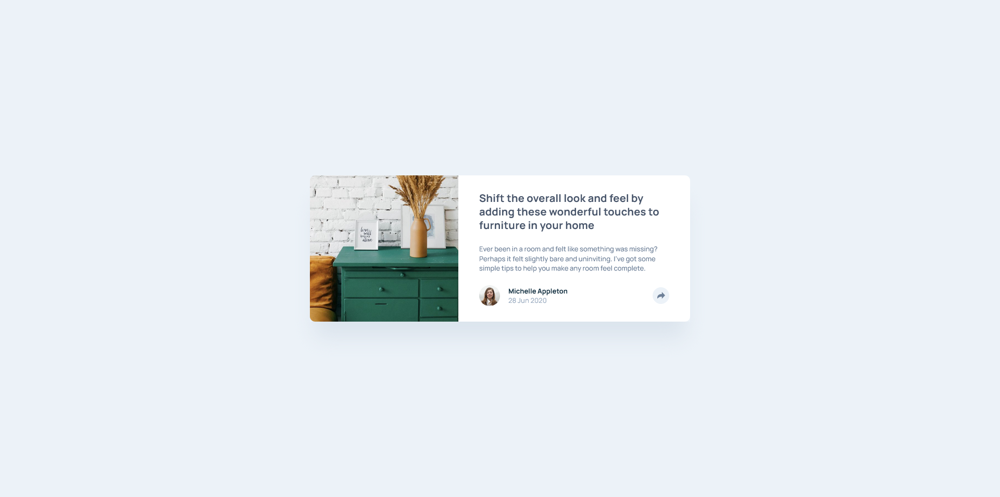

# Frontend Mentor - Article preview component solution

This is a solution to the [Article preview component challenge on Frontend Mentor](https://www.frontendmentor.io/challenges/article-preview-component-dYBN_pYFT). Frontend Mentor challenges help you improve your coding skills by building realistic projects. 

## Table of contents

- [Overview](#overview)
  - [The challenge](#the-challenge)
  - [Screenshot](#screenshot)
  - [Links](#links)
- [My process](#my-process)
  - [Built with](#built-with)
  - [What I learned](#what-i-learned)
- [Author](#author)

## Overview

### The challenge

Users should be able to:

- View the optimal layout for the component depending on their device's screen size
- See the social media share links when they click the share icon

### Screenshot



### Links

- Solution URL: [View solution on Frontend Mentor](https://www.frontendmentor.io/solutions/)
- Live Site URL: [View live site](https://alexander3717.github.io/ArticlePreviewComponent/)

## My process

### Built with

- Semantic HTML5 markup
- SASS features
- Flexbox
- Vanilla JavaScript
- Mobile-first workflow

### What I learned

For mobile layout I needed to create the share options toast, which would overlap the card footer. That gave me a chance to play with absolute positioning, which wasn't really required in the previous challenges.

On tablet and desktop layouts, the shape of the toast was more complicated - a rectangle with a small upside down triangle under it. I found out about a CSS trick which creates this triangle by cleverly utilizing the way how borders are rendered.

Here is the code snippet:

```scss
// code for the small upside down triangle
&::before {
    content:"";
    position: absolute;
    bottom: rem(-12px);
    left: 50%;
    transform: translateX(-50%);

    // the border trick
    border-top: rem(12px) solid $colors-grey-900;
    border-left: rem(12px) solid transparent;
    border-right: rem(12px) solid transparent;
}
```
Basically, when two borders meet in the corner, they do so at angles. And if you have a shape created solely by equally sized borders like in this case, its like the shape is made out of four equal triangles but you are only showing the top left and top right one, which creates the desired upside down triangle from the design.

This was my first challenge that required JavaScript. The task sounded easy - initiate the share options when someone clicks the share icon. But soon I realized that there are many things you need to account for, even when coding such a simple functionality, which as a user you take for granted.

I wanted to implement the following logic, which I thought was common for UX:
- On desktop, show the share options toast when hovering over share button and change the button color
- When no longer hovering over either, hide the toast and reset the button color
- After clicking the button, show the toast and "lock" it so it stays open even when the mouse moves away
- Allow the user to close the toast either by clicking the button again or anywhere else on the page
- Use subtle fade transitions for all visual changes

Getting this working I learned the very basics of handling events (for achieving the above I tracked click, mouseenter, mouseleave and transitionend) and also got some practice with DOM manipulation using methods like querySelector, classlist.add, setAtrribute etc.

## Author

Frontend Mentor - [@Alexander3717](https://www.frontendmentor.io/profile/Alexander3717)
